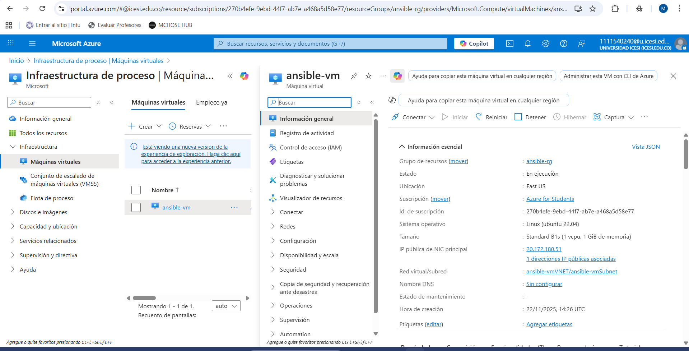
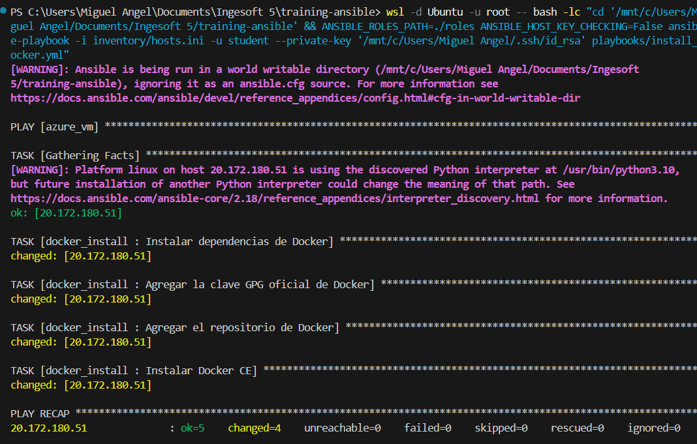
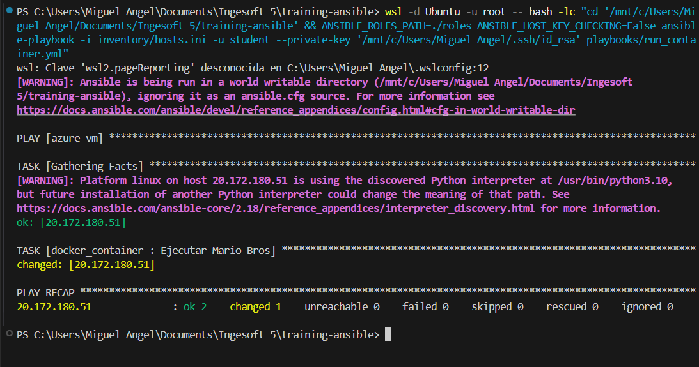
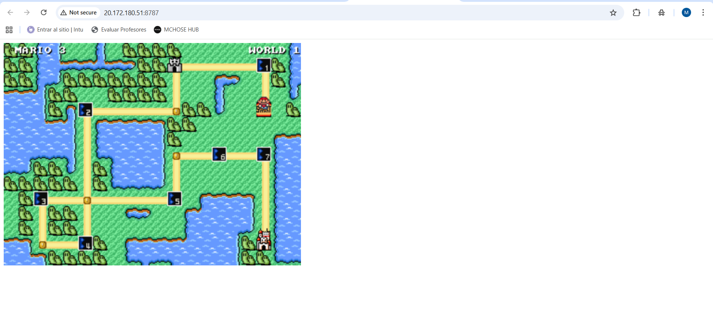

# Proyecto Ansible: Despliegue Automático de Mario Bros con Docker

En este repositorio se automatiza la provisión de una máquina virtual en Azure, la instalación de Docker y el despliegue de una imagen de juego en un contenedor, todo gestionado con Ansible.

## 1. Objetivo

- Ejecutar `install_docker.yml` para preparar la VM con Docker.
- Ejecutar `run_container.yml` para descargar y exponer la aplicación del juego en la red.

## 2. Prerrequisitos

- Cuenta de Azure con permisos para crear recursos.
- WSL (Ubuntu) en el equipo local para correr Ansible y Azure CLI.
- Ansible instalado en WSL (y `sshpass` si se opta por contraseña).

## 3. Configuración

### 3.1. Inventario de Ansible

Actualicé `inventory/hosts.ini` con la IP pública de la VM creada durante el ejercicio:

```ini
[azure_vm]
20.172.180.51
```

### 3.2. Regla de Red en Azure

Se abrió el puerto TCP `8787` en el NSG asociado para permitir el acceso al juego desde el navegador.

**Evidencia de la configuración en Azure:**



## 4. Comandos ejecutados

Los playbooks se lanzaron desde WSL en la raíz del repositorio usando el path de roles local:

```bash
ANSIBLE_ROLES_PATH=./roles ANSIBLE_HOST_KEY_CHECKING=False ansible-playbook -i inventory/hosts.ini playbooks/install_docker.yml
```

### 4.1. Instalación de Docker

```bash
ANSIBLE_ROLES_PATH=./roles ANSIBLE_HOST_KEY_CHECKING=False ansible-playbook -i inventory/hosts.ini playbooks/install_docker.yml
```

**Evidencia de la ejecución:**



### 4.2. Ejecución del Contenedor

```bash
ANSIBLE_ROLES_PATH=./roles ANSIBLE_HOST_KEY_CHECKING=False ansible-playbook -i inventory/hosts.ini playbooks/run_container.yml
```

**Evidencia de la ejecución:**


## 5. Resultado final

Una vez ejecutados ambos playbooks y configurada la regla de red, el juego es accesible a través de un navegador web en la siguiente URL:

`http://20.172.180.51:8787`

**El juego está desplegado y funcionando:**



---------


